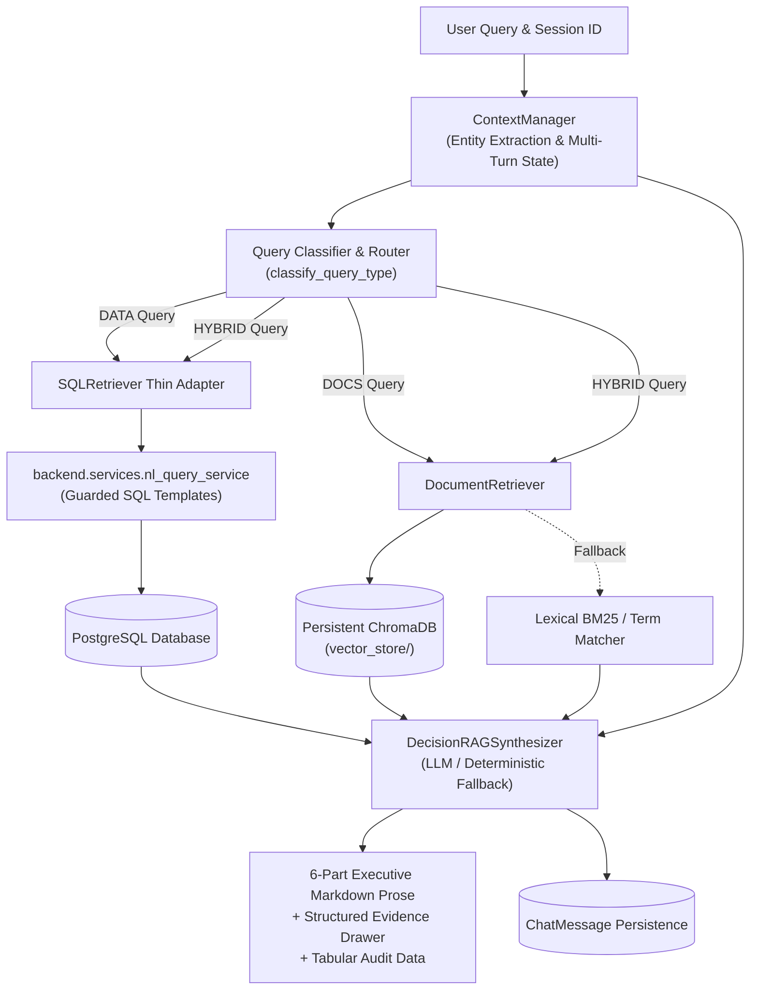

# RAG Chatbot Architecture Specification

**Module**: `rag-chatbot/`  
**Project**: Demand & Decision Intelligence System  
**Status**: Isolated & Decoupled Production Layer  

---

## 1. Executive Overview

The `rag-chatbot` module is an isolated, enterprise-grade decision intelligence engine for supply chain analytics. It provides **zero-bluff hybrid question answering** across:
1. **Live Structured Business Data**: PostgreSQL transactional demand records, inventory states, stockout alerts, and purchase orders.
2. **Project & Domain Documentation**: Architecture specifications, PRDs, engineering methodology guides, and inventory policies.

By decoupling the RAG logic from the core web backend, teammates can independently develop, test, review, and evaluate vector retrieval, conversational multi-turn context, and synthesis algorithms without disrupting the broader platform.

---

## 2. High-Level Architecture Diagram



---

## 3. Core Component Responsibilities

| Component | File Path | Core Responsibility |
| :--- | :--- | :--- |
| **Context Manager** | `backend/context_manager.py` | Extracts SKUs, quantities, locations, and intents across turns. Enforces **Strict No-Bluff**: never injects fake defaults (`19512`, `Delhi`, `500`, `45.0`). Rejects cost calculations when unverified. |
| **Query Router** | `backend/decision_rag_synthesizer.py` | Dynamically classifies queries into `DOCS` (pure documentation), `DATA` (live operational records), or `HYBRID` (operational data explained via policy). |
| **Document Retriever** | `backend/retrieval/document_retriever.py` | Thin wrapper over `KnowledgeBaseService` standardizing metadata, heading hierarchy, line numbers, and metric-accurate similarity scoring. |
| **SQL Retriever** | `backend/retrieval/sql_retriever.py` | Thin adapter reusing existing guarded SQL templates in `nl_query_service.py`. Queries catalog prices and verified supplier costs. |
| **Knowledge Base Service** | `backend/knowledge_base_service.py` | Document chunking with line-tracking, local embedding generation via `fastembed`, persistent ChromaDB indexing, and zero-dependency lexical fallback. |
| **Decision RAG Synthesizer** | `backend/decision_rag_synthesizer.py` | Orchestrates context, queries LLM (Groq / OpenAI) with temperature 0.1, or executes grounded 6-part deterministic synthesis. |
| **Document Ingestion CLI** | `ingestion/ingest_documents.py` | Standalone script to parse, chunk, and index all target project markdown files into `vector_store/`. |
| **Application Adapter** | `backend/services/rag_adapter.py` | Thin adapter in the main app connecting FastAPI endpoints (`backend/api/assistant.py`) to `rag-chatbot`. |

---

## 4. Key Architectural Invariants

### 4.1. Zero-SQL Duplication
The RAG module **never** duplicates database tables, SQL queries, or business forecasting logic. All guarded SQL queries remain exclusively owned by `backend/services/nl_query_service.py`. The RAG layer interacts with business data solely through `SQLRetriever`.

### 4.2. Strict No-Bluff Rule
- **No Inventions**: Never hallucinate numbers, prices, stock levels, or document claims.
- **Missing-Context Handling**: If a user asks *"What is the total procurement cost?"* and the required SKU, quantity, or unit cost cannot be verified from active session context or catalog data, the system explicitly returns:
  > *"I don't have enough verified data to calculate the procurement cost."*
- **No Hardcoded Defaults**: Fake values such as `product_id = 19512`, `city = "Delhi"`, `quantity = 500`, or `unit_cost = 45.0` are strictly banned from business logic.
- **Unsupported Claims Banned**: In HYBRID queries, the system never claims *"inventory reorder decisions protect target cycle service levels (95%)"* unless the 95% figure explicitly exists in the retrieved document text.

### 4.3. Mathematically Correct Similarity Scores
ChromaDB distance metrics are checked dynamically:
- **Cosine Space (`hnsw:space: "cosine"`)**: Distance $d = 1 - \cos(\theta)$. Similarity is calculated as $\text{score} = \max(0.0, \min(1.0, 1.0 - d))$.
- **L2 Space (`hnsw:space: "l2"`)**: Distance $d = \|u - v\|^2$. Similarity is calculated as $\text{score} = \frac{1}{1 + d}$.
- **Lexical Fallback**: When keyword fallback search is used, the score is labeled `retrieval_score` and `score_type = "lexical_frequency"`, never misleadingly labeled as semantic similarity.

### 4.4. 6-Part Standardized Markdown Format
All answers follow an executive structure:
```markdown
### Answer
[Direct 1-2 sentence executive answer]

### What this means
[Simple business interpretation based on verified facts]

### Key numbers
- **[Metric 1]**: [Verified value]
- **[Metric 2]**: [Verified value]

### Recommended action
[Action supported strictly by data, otherwise 'Monitor performance.']

### Evidence
- **Data Evidence**: [Key verified numbers or document citations]

### Source
Source:
- [List exact database tables and/or document paths]
```

---

## 5. Storage & Persistence

1. **Vector Store (`rag-chatbot/vector_store/`)**:
   - Stores persistent SQLite and HNSW index files generated by ChromaDB.
   - Vector store binary files are ignored by git (`.gitignore`), preserving only `.gitkeep`.
2. **PostgreSQL Session Storage**:
   - `chat_sessions`: Grouping conversations by user and tenant dataset.
   - `chat_messages`: Storing full message prose, execution time, and serialized `retrieved_context` (including intent, citations, and table samples).
